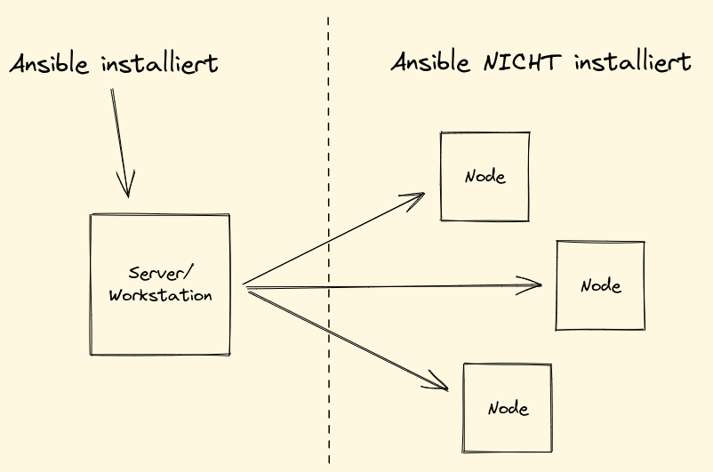
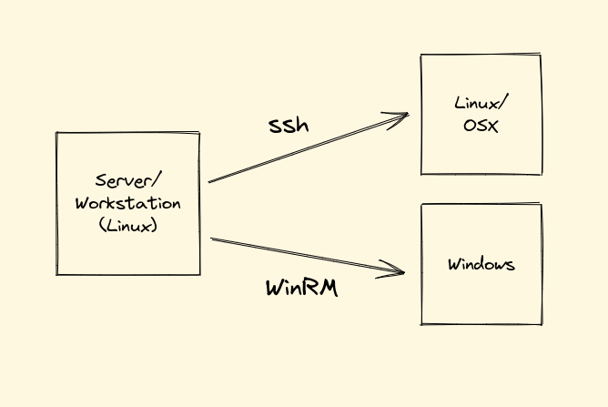
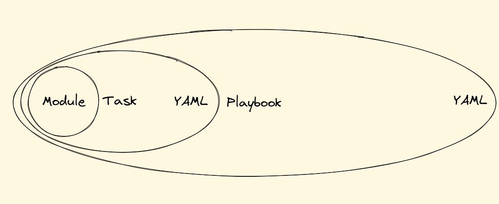

<style>
img[alt~="center"] {
  display: block;
  margin: 0 auto;
}
</style>

|
|
|
|

# Ansible Grundlagen

|
|
|
|

---

## Intension und Zielgruppe

- Verständnis schaffen wie mit Ansible technische Prozesse automatisiert werden können
- Befähigung zur Selbsthilfe durch vorhandene Dokumentation

Zielgruppe sind Menschen, die noch nicht oder sehr wenig mit Ansible gearbeitet haben.

---

## Inhalt

- Was ist Ansible
- Inventar
- Anwendungsfälle (Playbooks)
- Anwendungsfälle (Rollen)


---

## Was ist Ansible

Ansible ist eine Automatisierungs-Engine für IT Prozesse.

Es bietet Möglichkeiten für

- Provisionierung
- Konfigurationsmanagement
- Anwendungsbereitstellung
- Orchestrierung

---

## Architektur: Agentless



---

## Architektur: Verbindung



---

## Inventories

Inventories werden verwendet um Nodes für Ansible bekannt zu machen und zu klassifizieren und konfigurieren (i.d.R. Verbindungsparameter).

Es gibt **statische** und **dynamische** Inventories.

#### > Live-Übung

Wir erstellen das Inventory.

---

## Ad-hoc Befehle

Ansible bietet Ad-hoc Befehle um Nodes ohne Playbooks zu steuern oder den Status abzufragen. Diese Befehle werden mit `ansible -m <module> <filter>` ausgeführt.

#### Beispiel

```
$ ansible -i inventory/hosts -m ansible.builtin.ping all
$ ansible -i inventory/hosts -m ansible.builtin.ping linux
$ ansible -i inventory/hosts -m ansible.builtin.win_ping windows
```

---

## Node Fakten abfragen

Ansible stellt eine Liste von Fakten zur Verfügung, die auf jeder Node gesammelt werden. Fakten werden mit dem Modul `ansible.builtin.setup` abgefragt.

#### Beispiel

```
$ ansible -i inventory/hosts -m ansible.builtin.setup windows1
$ ansible -i inventory/hosts -m ansible.builtin.setup linux1
```

---

## Architektur: Modules, Tasks and Playbooks



<small>https://docs.ansible.com/ansible/2.9/modules/list_of_all_modules.html</small>

---

## YAML

YAML ist eine Datenserialisierungssprache mit deren Hilfe man Informationen strukturiert abbilden kann. Sie wird oft als Konfigurationssprache verwendet.

```yaml
---
key: value
list:
  - entry
  - entry
dict:
  key: value
  key: value
```

---

## Benutzerrechte eskalieren

Ansible Playbooks und Tasks bieten die Möglichkeit  Benutzerrechte zu eskalieren.

`become: true|false`

```yaml
---
- name: Beispiel für Benutzerrechteeskalation
  hosts: all
  become: true
  ...
```

---

## Installieren eines Programms

#### > Live-Übung

Wir installieren git auf einer Linux Node.

---

## Variablen

Tasks können mit Variablen so angepasst werden, dass die für verschiedene Szenarien wieder verwendet werden können.

Variablen werden mit der Syntax `"{{ variable_name}}"` verwendet.

#### Beispiel

```yaml
    - name: Task mit Variable
      ansible.builtin.file:
        path: "{{ dir_path }}"
        mode: '0644'
        state: directory
```

---

## Variablen

Variablen können u.a. in einem Playbook definiert werden.

#### Beispiel

```yaml
- name: Beispielplaybook mit Variablendefinition
  hosts: all
  vars:
    dir_path: /etc/ssh
  tasks:
    - name: Task mit Variable
      ansible.builtin.file:
        path: "{{ dir_path }}"
        mode: '0644'
        state: directory
```

---

## Variablen

Mit dem Modul `ansible.builtin.set_fact` können Variablen auch während eines Plays gesetzt werden.

#### Beispiel

```yaml
    - name: Setzen einer Variable im Play
      ansible.builtin.set_fact:
        dir_path: /etc/ssh
```

---

## Installieren eines Programms

Wir installieren 7zip auf einer Windows Node.

#### > Live-Übung

---

## Installieren eines Programms mit chocolatey

Mit dem Modul `chocolatey.chocolatey.win_chocolatey` können Programme auf Windows mit chocolatey installiert werden.

#### > Aufgabe

- Suchen Sie die Dokumentation für `win_chocolatey`
- Schreiben Sie ein Playbook, in dem notepad++ auf einem Windows Host installiert wird

---

## Ansible konfigurieren

Ansible kann an die eigenen Bedürfnisse angepasst werden mit Hilfe der `ansible.cfg` Datei auf der root-Ebene des Git Repositories.

#### > Live-Übung

Wir erstellen die `ansible.cfg` und füllen sie mit Werten.

---

## Gruppen Variablen

Im Inventory können Variablen spezifisch für Gruppen angelegt werden. Jede Node, die sich im Inventory befindet, ist automatisch Teil der Gruppe `all`.

Gruppenvariablen werden in

- `inventory/group_vars/<group_name>.yml` oder
- `inventory/group_vars/<group_name>/*.yml` definiert.

#### > Live-Übung

Wir erweitern das Inventory mit Gruppen Variablen.

---

## Sichere Variablen mit Vaults

Ansible bietet Vaults an um vertrauliche Variablen sicher zu speichern. Vaults werden mit `ansible-vault` verwaltet.

#### > Live-Übung

Wir erzeugen einen Vault und konfigurieren Ansible diesen zu benutzen.

---

## Jinja

Jinja ist eine Templatingengine welche von Ansible benutzt wird um Variablen und Templates zu verarbeiten.

- `` for Statements
- `{{ ... }}` for Expressions to print to the template output
- `{# ... #}` for Comments not included in the template output

```jinja
<ul id="navigation">
    
        <li><a href="{{ item.href }}">{{ item.caption }}</a></li>
    
</ul>
```

---

## Filter

In Ansible werden Jinja Filter verwendet um Variablen während des Plays anzupassen.

#### Beispiel

```yaml
    - name: Variablennutzung mit Filter
      ansible.builtin.file:
        path: "{{ dir_path | default('/tmp/ssh') }}"
        mode: '0644'
        state: directory
```

---

## Schleifen

Schleifen werden in Ansible mit dem Keyword `loop` angewendet. Es kann über Listen und Dictionaries iterieren.

#### Beispiel

```yaml
    - name: Task mit einer Schleife
      ansible.builtin.file:
        path: "{{ item.path }}"
        mode: '0644'
        state: directory
      loop:
        - /etc/ssh
        - /etc/apt
```

---

## Anlegen von Benutzern

#### > Live-Übung

Wir erzeugen Gruppen und Benutzer in Linux.

#### Aufgabe

- Erzeugen Sie die gleichen Gruppen und Benutzer in Windows
- **Tip:** In Windows dürfen Gruppen und Benutzer nicht den gleichen Namen haben.
- **Tip:** Dateien unterhalb von `group_vars/all` werden immer ausgelesen.

---

## Templates

Mit Templates können Dateien erzeugt werden, deren Inhalt variabel ist. Innerhalb von Templates können alle Variablen benutzt werden, die sich in einem Play befinden.

Für Templates wird die Sprache **Jinja** verwendet.

```jinja
<ul id="navigation">
    
        <li><a href="{{ item.href }}">{{ item.caption }}</a></li>
    
</ul>
```

---

## Handlers

**Handlers** sind Tasks, die auf Change-Events reagieren. Mit Hilfe von Handlern können z.B. Dienste oder Hosts automatisch neugestartet werden, wenn sich die Konfiguration ändert.

---

## Handlers (Beispiel)

```yaml
  tasks:
    - name: Update all packages to the latest version
      ansible.builtin.apt:
        upgrade: dist
        update_cache: true
      notify: reboot

  handlers:
    - name: Reboot the server
      ansible.builtin.reboot:
      listen: reboot
```

---

## Tags

Mit Hilfe von **Tags** können während eines Plays die Tasks gefiltert werden, die ausgeführt werden.

Tags werden mit `-t/--tags` auf der Kommandozeile verwendet.

```
$ ansible-playbook -i inventory playbooks/play.yml -t install
```

---

## Tags (Beispiel)

```yaml
  - name: Install nginx
  ansible.builtin.apt:
    name: nginx
    state: present
  tags:
    - install

- name: Copy nginx config
  ansible.builtin.template:
    src: nginx.conf.j2
    dest: "{{ nginx_config_dir }}/nginx.conf"
    mode: '0644'
  tags:
    - config
```

---

## Roles und Communities

**Roles** sind abgeschlossene Container, die Tasks, Handlers, Dateien, Templates, Variablen und Tests enthalten. Sie können verwendet werden um komplizierte Abläufe abzubilden, die aber dennoch entsprechend ihres Einsatzzwecks konfiguriert werden können.

**Communities** sind organisatorische Container, in denen mehrere Rollen und Module veröffentlicht werden.

---

## Ansible Galaxy

Die **Ansible Galaxy** is eine Platform, auf der Rollen und Communities geteilt werden.

https://galaxy.ansible.com

Das gleichnamige Kommandozeilenwerkzeug bietet die Möglichkeit sowohl Rollen und Communities zu installieren als auch neue zu erschaffen.

---

## Aufsetzen eines Webservers

#### > Live-Übung

Wir installieren und konfigurieren einen Webserver auf Linux inklusive der Webseiten.

---

## Hostvariablen

Im Inventory können Variablen spezifisch für Hosts angelegt werden.

Hostvariablen werden in

- `inventory/host_vars/<group_name>.yml` oder
- `inventory/host_vars/<group_name>/*.yml` definiert.

---

## Task Ergebnisse registrieren

Ausgeführte Tasks bieten i.d.R. Informationen über den Änderungsstatus, den Erfolgsstatus und Task spezifische Informationen. Diese Informationen können mit Hilfe von `register` gespeichert werden.

#### Beispiel

```yaml
    - name: Get the domain name
      ansible.windows.win_reg_stat:
        path: HKLM:\SYSTEM\CurrentControlSet\Services\Tcpip\Parameters
        name: Domain
      register: _domain_name
```

---

## Testen mit Assert

Das Module `ansible.builtin.assert` kann benutzt werden um den Inhalt von Variablen zu bestätigen.

#### Beispiel

```yaml
    - name: Check that the content of number is 10
      ansible.builtin.assert:
        that:
          - number is defined
          - number == 10
```

---

## Aufsetzen eines Windows Domänencontrollers

#### > Live-Übung

Wir installierem einen Domänencontroller auf einem Windows Host.

---

## Zusammenfassung

- Sie haben die gängisten Konzepte von Ansible kennen gelernt.
- Sie haben gesehen wie man Playbooks und Rollen erzeugt um Schritte zu automatisieren.
- Sie verstehen wie man mit Hilfe von Templates Konfigurationsdateien für unterschiedliche Umgebungen bereit stellt

#### Fragen?
