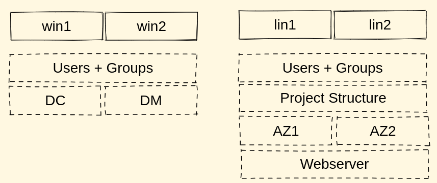

<style>
img[alt~="center"] {
  display: block;
  margin: 0 auto;
}
</style>

|
|
|
|

# Ansible Grundlagen

|
|
|
|

---

## Intension und Zielgruppe

- Verständnis schaffen wie mit Ansible technische Prozesse automatisiert werden können
- Befähigung zur Selbsthilfe durch vorhandene Dokumentation

Zielgruppe sind Menschen, die noch nicht oder sehr wenig mit Ansible gearbeitet haben.

---

## Inhalt

- Was ist Ansible
- Inventar
- Anwendungsfälle (Playbooks)
- Anwendungsfälle (Rollen)


---

## Was ist Ansible

Ansible ist eine Automatisierungs-Engine für IT Prozesse.

Es bietet Möglichkeiten für

- Provisionierung
- Konfigurationsmanagement
- Anwendungsbereitstellung
- Orchestrierung

---

## Architektur: Agentless


---

## Architektur: Verbindung


---

## Architektur: Nodes

**Control Nodes:** Machinen auf denen Ansible installiert ist und von denen aus Ansible ausgeführt wird.

**Managed Nodes:** Machinen, die von Control Nodes verwaltet werden.

**Groups:** Machinen können in Gruppen zusammengefasst werden um gemeinsam verwaltet zu werden.

---

## Inventories

Inventories werden verwendet um Nodes für Ansible bekannt zu machen und zu klassifizieren und konfigurieren (i.d.R. Verbindungsparameter).

Es gibt **statische** und **dynamische** Inventories.

#### > Live-Übung

Wir erstellen das Inventory.

---

## Ad-hoc Befehle

Ansible bietet Ad-hoc Befehle um Nodes ohne Playbooks zu steuern oder den Status abzufragen. Diese Befehle werden mit `ansible -m <module> <filter>` ausgeführt.

#### Beispiel

```
$ ansible -i inventory/hosts -m ansible.builtin.ping all
$ ansible -i inventory/hosts -m ansible.builtin.ping linux
$ ansible -i inventory/hosts -m ansible.builtin.win_ping windows
```

---

## Node Fakten abfragen

Ansible stellt eine Liste von Fakten zur Verfügung, die auf jeder Node gesammelt werden. Fakten werden mit dem Modul `ansible.builtin.setup` abgefragt.

#### Beispiel

```
$ ansible -i inventory/hosts -m ansible.builtin.setup windows1
$ ansible -i inventory/hosts -m ansible.builtin.setup linux1
```

---

## Architektur: Modules, Tasks and Playbooks

**Modules:** Arbeitsabläufe, die von Ansible auf die Managed Nodes ausgerollt werden.

**Tasks:** Kontrollieren die Ausführung von Modulen mit Parametern und Kontrollstrukturen (z.B. Schleifen)

**Playbooks:** Geordnete Abfolge von Tasks

**Play:** Ausführung eines Playbooks auf ein oder mehrere Managed Nodes

---

## Architektur: YAML und Jinja

**YAML:** Konfigurationssprache mit menschenlesbarer Syntax. Das meiste in Ansible ist in YAML beschrieben.

**Jinja:** Templatingsprache um Dateien und Playbooks für unterschiedliche Umgebungen anzupassen.

---

## Architektur: Roles und Collections

**Roles** sind abgeschlossene Container, die Tasks, Handlers, Dateien, Templates, Variablen und Tests enthalten. Sie können verwendet werden um komplizierte Abläufe abzubilden, die aber dennoch entsprechend ihres Einsatzzwecks konfiguriert werden können.

**Collections** sind organisatorische Container, in denen mehrere Rollen und Module veröffentlicht werden.

---

## Ansible Galaxy

Die **Ansible Galaxy** is eine Platform, auf der Rollen und Collections geteilt werden.

https://galaxy.ansible.com

Das gleichnamige Kommandozeilenwerkzeug bietet die Möglichkeit sowohl Rollen und Collections zu installieren als auch neue zu erschaffen.

---

## Showcase



---

## Zusammenfassung

- Sie haben die gängisten Konzepte von Ansible kennen gelernt.
- Sie haben gesehen wie man Playbooks und Rollen erzeugt um Schritte zu automatisieren.
- Sie verstehen wie man mit Hilfe von Templates Konfigurationsdateien für unterschiedliche Umgebungen bereit stellt

#### Fragen?
