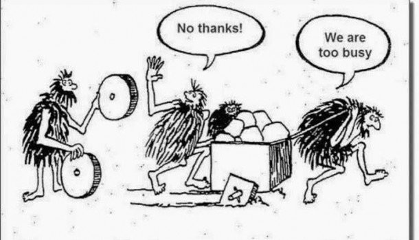
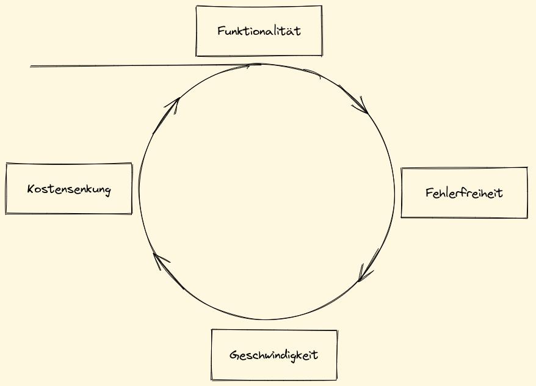
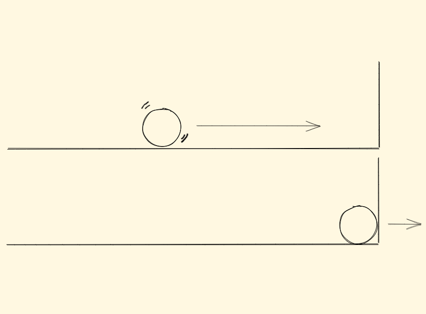

|
|
|
|

# Automation

|
|
|
|

---

## Intension und Zielgruppe

Verständnis schaffen warum und wann Automation sinnvoll ist und welche Konzepte es gibt.

Zielgruppe sind Menschen, die Prozesse anwenden oder Prozesse automatisieren.

---

## Inhalt

- Was ist Automatisierung
- Warum ist Automatisierung wichtig
- Wann ist Automatisierung sinnvoll (und wann nicht)
- Konzepte der Automatisierung

---

## Was ist Automatisierung

**Philosophisch:** Bei der Automatisierung geht es letzten Endes darum den Menschen aus dem Arbeitsprozess zu befreien. (Aristoteles)

**Technisch:** Systemen beibringen

- autonom zu handeln und Ziele zu verfolgen (z.B. CI/CD)
- neue Ziele zu erkennen (z.B. Dependabot)
- den Betrieb bei Störungen aufrecht zu erhalten (z.B. Kubernetes)

---

## Warum ist Automatisierung wichtig

Durch die autonome Ausführung wiederkehrender Prozesse wird die Zeit und Arbeitskraft des Menschen freigesetzt für

- Innovation
- Lösung komplexer Probleme
- Monetarisierbare Arbeit
- Erholung

Wird diese Arbeitskraft nicht gebraucht spricht man von Kostenreduktion.

---

## Warum ist Automatisierung wichtig

---

## Warum ist Automatisierung wichtig

Automatisierung führt auch zu Kostenreduktion durch

- geringerer Resourcenverbrauch (Workstation vs. Skriptausführung)
- schnellere Prozessausführung (z.B. Cloud Instancen)
- geringere Personalkosten

---

## Warum ist Automatisierung wichtig

---

## Wann ist Automatisierung sinnvoll

- Häufig wiederkehrende Prozesse
- Niedrige Komplexität > Hohe Komplexität
- Implementationszeit < Ausführungszeit in Summe

#### Beispiel

**French Press:** 365 Tage * 15 Minuten = 5475m = 91,25h

**Kaffeemachine:** 365 Tage * 2 Minuten = 730m = 12,17h

---

## Konzepte der Automatisierung

- Prozess der Automatisierung
- Kreislauf der Automatisierung
- Idempotence

---

## Prozess der Automatisierung

- Prozess und Ziel verstehen
- Prozess beobachten
- Prozess manuell durchführen
- Prozess aufschreiben, aufnehmen oder aufzeichnen
- Prozess implementieren
- Implementation testen
- Implementation optimieren

---

## Kreislauf der Automatisierung

---

## Idempotence

Idempotence beschreibt die Fähigkeit eines Prozesses bei wiederholter Ausführung zum gleichen Ergebnis zu führen.

---

## Zusammenfassung

- Sie verstehen jetzt was Automatisierung ist und warum sie wichtig ist
- Sie wissen wann Sie einen Prozess automatisieren sollten und wann nicht
- Sie verstehen die gängisten Konzepte der Automatisierung

#### Fragen?
