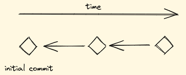
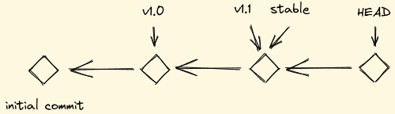
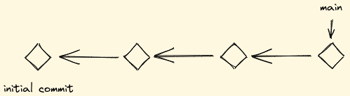
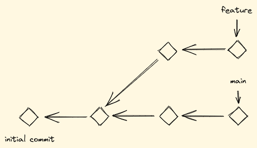
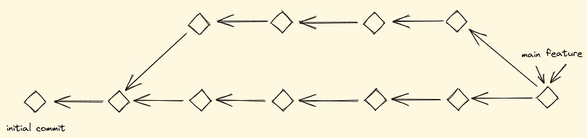
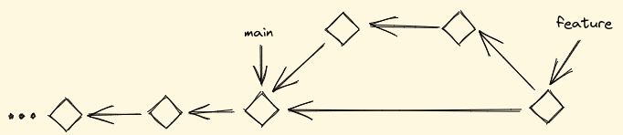
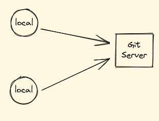
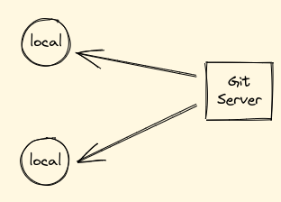
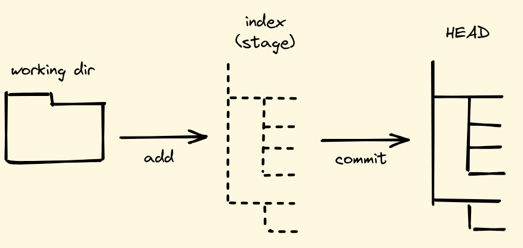

<style>
img[alt~="center"] {
  display: block;
  margin: 0 auto;
}
</style>

|
|
|
|

# Git Grundlagen

|
|
|
|

---

## Intension und Zielgruppe

Verständnis schaffen

- wie die eigene Arbeit in Git gespeichert wird
- wie lokale Änderungen zu einem zentralen Server gelangen
- wie Änderungen vom Server nach lokal gelangen
- wie parallel an einem Projekt gearbeitet werden kann

Die Zielgruppe sind Menschen, die noch gar nicht mit Git gearbeitet haben.

---

## Inhalt

- Begriffserklärung
- Die drei Bäume von Git
- Aufbau eines Repositories von Null

---

## Was ist Git

Git ist ein schnelles, verteiltes Versionierungssystem.

Es bietet:

- Momentaufnahmen
- Wiederherstellung
- Nachvollziehbarkeit
- Kollaboration

---

## Was ist ein Git Repository

Ein Verzeichnis, in dem ein `.git` Verzeichnis liegt, nennt man ein Repository.

`.git` enthält Metadaten für das Arbeiten mit Git.

Alle Dateien in einem Repository (mit Ausnahme `.git`) können **commited** werden.

---

## Was ist ein Commit

Ein Commit ist eine Momentaufnahme, bei dem der Unterschied zu einem vorherigen Commit (**parent**) gespeichert wird (inkrementell).

Ein Commit hat immer einen parent außer es ist der erste Commit in einem Repository.



---

# Was ist ein Commit Hash

Jeder Commit hat eine eindeutige Kennung mit welcher er identifiziert werden kann.

Anhand des Hashes erkennt ein Commit seinen parent Commit.

Lange Form: `2292229534b11d061273dcc1af82514cce23f09d`

Kurze Form: `2292229`

---

## Was ist ein Tag

Ein Tag ist ein Zeiger, der immer auf einen spezifischen Commit zeigt.

Mehrere Tags können auf den gleichen Commit zeigen.



---

## Was ist ein Branch

Ein Branch ist eine Kette von Commits auf dessen letzten Commit ein Tag mit dem Namen des Branches zeigt.

Der erste (default) Branch in einem Repository heißt üblicherweise `main` (früher `master`).



---

## Was ist Branching

Wenn ein weiterer Branch erzeugt wird, spricht man von Branching.

Dies ermöglicht die parallele Arbeit mehrerer Personen am selben Projekt.



---

## Was ist ein Merge

Bei einem Merge werden zwei Branches zusammen geführt und die Änderungen beider Branches kombiniert.

Wenn in beiden Branches die gleiche Datei verändert wurde, führt das zu **Merge Konflikten**.



---

## Was ist ein Rebase Merge

Bei einem rebase Merge wird der Parent des ersten Branches auf den letzten Commit des zweiten Branches gelegt.

Das führt zu einer klareren Commit Geschichte und verhindert Merge Konflikte beim Mergen.



---

## Was ist ein Push

Bei einem Push werden Commits, Tags und Branches vom lokalen Repository zu einem zentralen Server gesendet, auf den mehrere Personen Zugriff haben.



---

## Was ist ein Pull

Bei einem Pull werden Commits, Tags und Branches von einem zentralen Server zum lokalen Repository geladen.



---

## Was bedeutet Add/Reset

Mit **Add** werden Dateien für einen Commit vorbereitet. Alle anderen Dateien werden im nächsten Commit ignoriert.

Mit **Reset** werden Dateien für den nächsten Commit als nicht relevant markiert. Es ist die Gegenaktion zu **Add**.

---

## Zusammenfassung der Begriffe

- Repository
- Commit/Commit Hash
- Tag
- Branch
- Merge
- Rebase
- Push/Pull
- Add/Reset

---

## Die drei Bäume von Git



---

## Aufbau eines Repositories von Null

- Git konfigurieren
- Repository initialisieren
- Remote Origin anlegen
- Dateien committen
- Änderungen zu Origin pushen
- Git History resetten
- Änderungen von Origin pullen
- Branch erstellen und mergen

---

## Git konfigurieren

Git kann für die eigenen Bedürfnisse angepasst werden.

Auflisten der bestehenden konfiguration:

`git config -l` für lokales Repository
`git config --global -l` für globale Konfiguration

#### Beispiel

```
$ git config --global user.name "Vorname Nachname"
$ git config --global user.email "name@example.tld"
$ git config --global init.defaultBranch main
```

---

## Repository initialisieren

Mit `git init` wird ein neues Git Repository angelegt.

Dabei wird das Verzeichnis `.git` erzeugt und mit Metadaten gefüllt.

#### Beispiel

```
$ mkdir tsteinert-ansible
$ cd tsteinert-ansible
$ git init
$ ls -1a
./
../
.git/
```

---

## Remote Origin anlegen

M `git remote` werden entfernte Git Server zum lokalen Repository hinzugefügt.

#### Beispiel

```
$ git remote add origin git@github.com/chronicc/ansible-essentials.git
$ git remote show origin
* remote origin
  Fetch URL: git@github.com:chronicc/ansible-essentials.git
  Push  URL: git@github.com:chronicc/ansible-essentials.git
  HEAD branch: main
  ...
```

---

## Status des Repository abfragen

Mit `git status` werden Informationen zum Zustand des Repositories ausgegeben.

#### Beispiel

```
$ git status
On branch main

No commits yet

nothing to commit (create/copy files and use "git add" to track)
```

---

## Dateien zum Index hinzufügen

Mit `git add <file>` wird eine Datei zum **Index** hinzugefügt werden.

#### Beispiel

```
$ touch .gitignore
$ git add .gitignore
$ git status
On branch main

No commits yet

Changes to be committed:
  (use "git rm --cached <file>..." to unstage)
	new file:   .gitignore
```

---

## Dateien vom Index entfernen

Mit `git reset <file>` wird eine Datei vom **Index** entfernt werden.

#### Beispiel

```
$ git reset .gitignore
$ git status
On branch main

No commits yet

Untracked files:
  (use "git add <file>..." to include in what will be committed)
	.gitignore
```
---

## Dateien committen

Mit `git commit` werden alle Dateien vom **Index** in einem Commit zusammengefasst.

#### Beispiel

```
$ git add .gitignore
$ git commit -m "Add .gitignore"
[main (root-commit) a416bd4] Add .gitignore
 1 file changed, 0 insertions(+), 0 deletions(-)
 create mode 100644 .gitignore
```

---

## Git History inspizieren

Mit `git log` wird die Git History angezeigt.

#### Beispiel

```
$ git log --oneline
c1ec34e (HEAD -> main) Add README.md
e37f2a5 Add .gitignore
```

---

## Änderungen zu Origin pushen

Mit `git push` werden Commits vom lokalen Repository zum **remote** Server gesendet.

#### Beispiel

```
$ git push
Enumerating objects: 4, done.
Counting objects: 100% (4/4), done.
Delta compression using up to 20 threads
Compressing objects: 100% (2/2), done.
Writing objects: 100% (3/3), 270 bytes | 270.00 KiB/s, done.
...
```

---

## Noch mehr Dateien committen und pushen

#### Beispiel

```
$ echo "# Ansible Workshop" > README.md
$ git add README.md
$ git commit -m "Add README.md"
$ git push
```

---

## Git History resetten

Mit `git reset --hard <commit_hash>` oder `git reset --hard HEAD~<x>` wird die Git History auf diesen Commit zurück gesetzt. All Commit, die danach entstanden, werden im lokalen Repository gelöscht.

#### Beispiel

```
$ git log --oneline
$ git reset --hard HEAD~1
$ git log --online
```

---

## Änderungen von Origin pullen

Mit `git pull` werden Commits vom **remote** Server in das lokale Repository geladen.

#### Beispiel

```
$ git pull
Updating 9499860..2292229
Fast-forward
 README.md | 0
 1 file changed, 0 insertions(+), 0 deletions(-)
 ...
```

---

## Einen Branch erstellen

Mit `git branch <branch_name>` wird ein neuer Branch erstellt. Mit `git checkout` <branch_name> wird zu diesem Branch gewechselt. Mit `git branch` werden alle Branches des lokalen Repositories aufgelisted.

#### Beispiel

```
$ git branch
$ git branch update-gitignore
$ git checkout update-gitignore
$ git branch
```

---

## Die .gitignore erweitern

Fügen Sie den String `.venv/` zur `.gitignore` hinzu und committen Sie diese Änderung. Pushen Sie dann diese Änderungen zum `origin/update-gitignore`.

#### Beispiel

```
$ echo ".venv" >> .gitignore
...?
```

---

## Den Branch mergen

Checken Sie den default Branch aus (`main`/`master`) und mergen Sie den `update-gitignore` Branch.

#### Beispiel

```
...?
$ git merge update-gitignore
$ git push
$ git log --graph
```

---

## Ein Repository clonen

Mit `git clone <url>` kann ein Repository von einem Server gecloned werden.

#### Beispiel

```
$ git clone https://github.com/chronicc/ansible-essentials.git
```
<!-- Dateien von ansible-essentials in das neu angelegte Repository kopieren und make install ausführen. -->

---

## Zusammenfassung

- Sie kennen nun die gängigen Begriffe im Zusammenhang mit Git
- Sie verstehen das Konzept der drei Bäume von Git
- Sie haben ein Git Repository initialisiert und die gängisten Funktionen von Git angewendet

#### Fragen?

https://education.github.com/git-cheat-sheet-education.pdf
