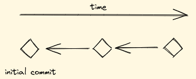
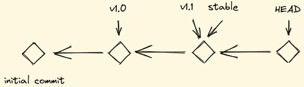
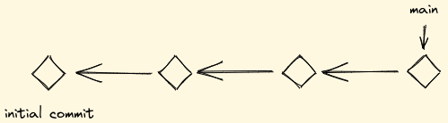
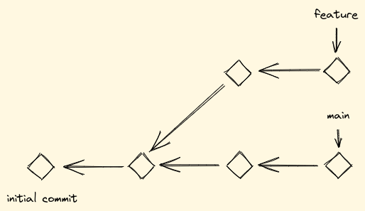
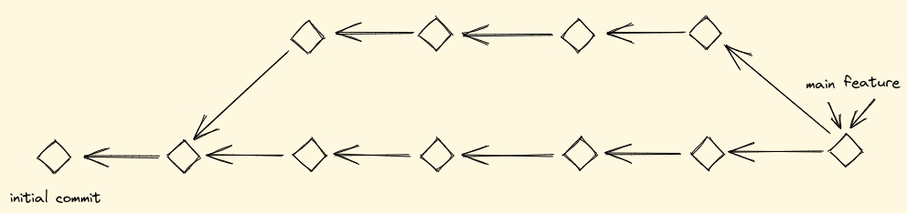
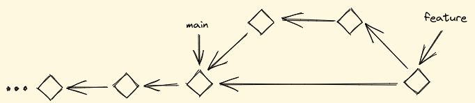
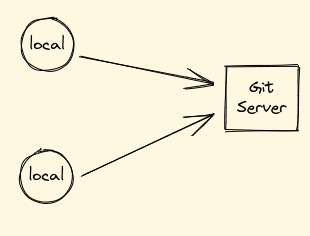
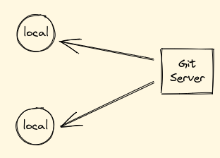
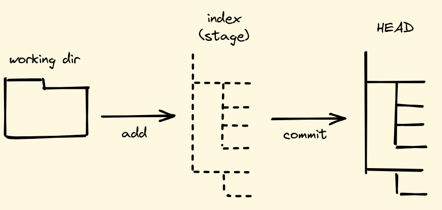

|
|
|
|

# Git Einführung

|
|
|
|

---

## Intension und Zielgruppe

Verständnis schaffen

- wie die eigene Arbeit in Git gespeichert wird,
- wie lokale Änderungen zu einem zentralen Server gelangen
- wie Änderungen vom Server nach lokal gelangen
- wie parallel an einem Projekt gearbeitet werden kann

Die Zielgruppe sind Menschen, die noch gar nicht mit Git gearbeitet haben.

---

## Inhalt

- Begriffserklärung
- Die drei Bäume von Git
- Kommandos

---

## Was ist Git

Git ist ein schnelles, verteiltes Versionierungssystem.

Es bietet:

- Momentaufnahmen
- Wiederherstellung
- Nachvollziehbarkeit
- Kollaboration

---

## Was ist ein Git Repository

Ein Verzeichnis, in dem ein `.git` Verzeichnis liegt, nennt man ein Repository.

`.git` enthält Metadaten für das Arbeiten mit Git.

Alle Dateien in einem Repository (mit Ausnahme `.git`) können **commited** werden.

---

## Was ist ein Commit

Ein Commit ist eine Momentaufnahme, bei dem der Unterschied zu einem vorherigen Commit (**Parent**) gespeichert wird (inkrementell).

Ein Commit hat immer einen **Parent** außer es ist der erste Commit in einem Repository.

---

## Was ist ein Tag

Ein Tag ist ein Zeiger, der immer auf einen spezifischen Commit zeigt.

Mehrere Tags können auf den gleichen Commit zeigen.

---

## Was ist ein Branch

Ein Branch ist eine Kette von Commits auf dessen letzten Commit ein Tag mit dem Namen des Branches zeigt.

Der erste (default) Branch in einem Repository heißt üblicherweise `main` (früher `master`).

---

## Was ist Branching

Wenn ein weiterer Branch erzeugt wird, spricht man von Branching.

Dies ermöglicht die parallele Arbeit mehrerer Personen am selben Projekt.

---

## Was ist ein Merge

Bei einem Merge werden zwei Branches zusammen geführt und die Änderungen beider Branches kombiniert.

Wenn in beiden Branches die gleiche Datei verändert wurde, führt das zu **Merge Konflikten**.

---

## Was ist ein Rebase Merge

Bei einem rebase Merge wird der Parent des ersten Branches auf den letzten Commit des zweiten Branches gelegt.

Das führt zu einer klareren Commit Geschichte und verhindert Merge Konflikte beim Mergen.

---

## Was ist ein Push

Bei einem Push werden Commits, Tags und Branches vom lokalen Repository zu einem zentralen Server gesendet, auf den mehrere Personen Zugriff haben.

---

## Was ist ein Pull

Bei einem Pull werden Commits, Tags und Branches von einem zentralen Server zum lokalen Repository geladen.

---

## Was bedeutet Add/Reset

Mit **Add** werden Dateien für einen Commit vorbereitet. Alle anderen Dateien werden im nächsten Commit ignoriert.

Mit **Reset** werden Dateien für den nächsten Commit als nicht relevant markiert. Es ist die Gegenaktion zu **Add**.

---

## Zusammenfassung der Begriffe

- Repository
- Commit
- Tag
- Branch
- Merge
- Rebase
- Push/Pull
- Add/Reset

---

## Die drei Bäume von Git

---

## Kommando: config

Git kann für die eigenen Bedürfnisse angepasst werden.

Auflisten der bestehenden konfiguration:

`git config -l` für lokales Repository
`git config --global -l` für globale Konfiguration
